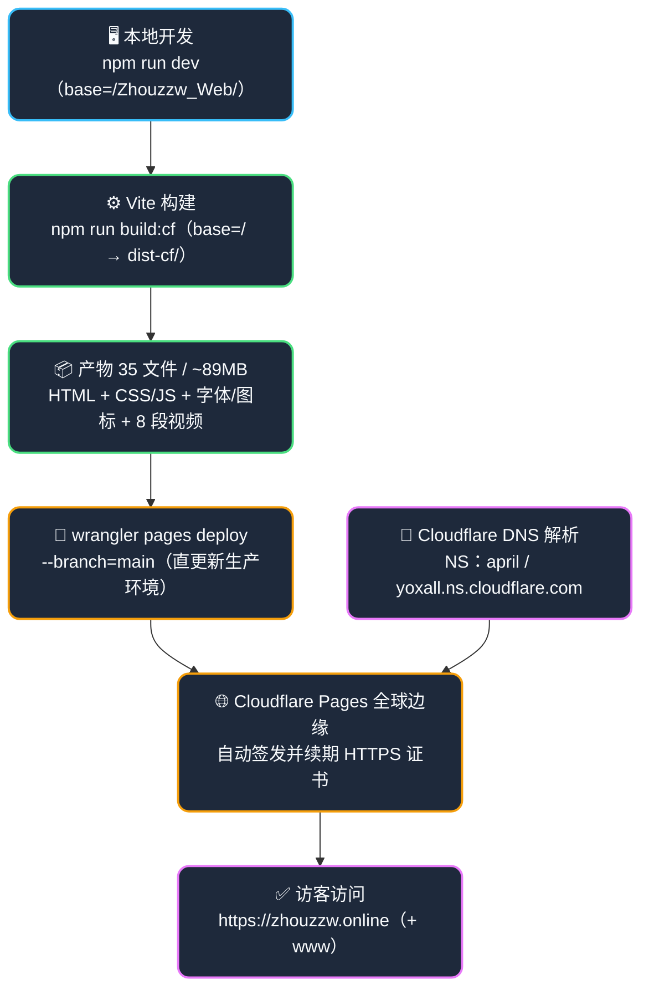

# 周子惟 · 嵌入式与机器人开发个人品牌站点

[](https://zhouzzw.online)
[](https://vitejs.dev/)
[]()
[](https://pages.cloudflare.com/)
[]()
[]()

面向求职展示的**个人品牌站点**工程：单页长滚动、Vanilla HTML / CSS / JS 手写、Vite 构建，**无任何运行时依赖与后端**——以全站零外链（字体 / 图标全部自托管）+ Cloudflare Pages 海外节点实现中国大陆可直连、免备案。线上入口：**https://zhouzzw.online**（正式，根域 + `www`）。应用于**简历投递与面试展示**——访客在一个页面内看完技术栈（35 条目 / 8 领域）、4 个项目（2 竞赛 + 2 工业 G1-D 臂）、实习经历与联系方式。

> 🌐 **线上入口**：正式 **https://zhouzzw.online**（+ `www`）｜备用 `https://zhouzzw-web.pages.dev`（⚠️ `pages.dev` 国内 DNS 污染）｜海外镜像 `https://zhouzzw.github.io/Zhouzzw_Web/`（push `v2` 分支由 Actions 自动构建部署）

---

## 最近里程碑

- **【2026-09-22】自有域名全链路打通** —— `zhouzzw.online` + `www` 双入口 HTTPS 200（注册局 NS → Cloudflare zone → Pages），证书由 Google Trust Services 自动签发与续期
- **【2026-09-22】外链清零 + Cloudflare Pages 上线** —— 字体 / 图标全部自托管（外链 **5 → 0**），国内可直连；腾讯云 CloudBase 默认域名经浏览器实测否决
- **【2026-09-22】文案与交互系统性精修** —— Hero / 关于重写、技术栈 40 → **35 项**校准、视频弹层「方案 A」（能自动播放则不遮挡 poster）、G1-D 双卡成果区改纯数据结论
- **【2026-09-21】移动端视频黑屏修复** —— 封面改 `poster` 静帧 + 弹层覆盖层，弱网出图 12.6s → **0.31s**，封面阶段 mp4 请求数归零
- **【2026-09-17】CTA 画面切换动效与螺旋性能优化** —— 螺旋删每帧滤镜 + 延迟启动 + 不可见暂停（加载 12 → **32 FPS** / 稳态 17 → **42.5 FPS**）

---

## 核心功能

1. **单页长滚动 8 区块** — Hero → 简介 → 技术栈 → 项目 → 实习 → 荣誉 → 关于 → 联系；锚点导航 + scrollspy 高亮
2. **技术栈 35 条目 / 8 个技术领域** — 掌握度五档进度条可视化 + 分类筛选（全部 / 嵌入式 / 控制 / ROS / 强化学习 …）
3. **4 张项目卡** — 2 竞赛（RM 串联腿平衡步兵 / 全向轮步兵）+ 2 工业（G1-D 机械臂 Tesseract 规划 / Isaac RL 端到端），成果区为纯数据结论（5mm / 3° · 1.75s → 0.21~0.60s 约 **5×** · 到位率 **90.9%**）
4. **8 段演示视频弹层播放** — `poster` 静帧封面（封面阶段 mp4 请求 **0**）+ 覆盖层状态提示（点击播放 / 加载中 x%）+ Range 分段流（可拖拽进度）
5. **交互动效体系** — Hero 打字机、数字滚动计数（`js-count`）、SVG 螺旋、播放键 hover 光圈画圆（`stroke-dashoffset`）、标签近距磁吸
6. **国内可直连（免备案）** — 字体子集化 17.7MB → **259KB**（903 汉字）；Google Fonts / jsdelivr / 图标 CDN 全部移除
7. **SEO 与社交分享完备** — canonical / OG / twitter / JSON-LD / sitemap / robots 统一指向正式域名；分享图 `og-cover.jpg`（1200×630，路径不随构建变化）
8. **三档响应式基线可回归** — 1440 / 390 / 360 页高实测基线（15465 / 15379 / 15424 px），改动零回归可量化验证

---

## 技术路线

**浏览器侧零依赖，全部复杂性收敛在「构建 → 部署 → 边缘分发」一条链上**：



**没有服务器、没有运行时**：站点是纯静态文件，域名在阿里云注册但解析托管于 Cloudflare（改 NS 的含义），内容由 CF 全球边缘就近分发。

---

## 快速开始

> ⚠ **两套 base 路径不可混用，这是本站第一坑**：Cloudflare Pages 必须 `--base=/`（`npm run build:cf`），GitHub Pages 必须 `--base=/Zhouzzw_Web/`（`npm run build`，仓库名即子路径）。
> 用错 → 产物内资源引用全部 404 → 线上白屏。

### 🖥️ 本地开发（日常迭代）

```bash
# ① 安装依赖（仅首次）
npm install

# ② 启动开发服务器（热更新）
npm run dev            # → http://localhost:5173/Zhouzzw_Web/
```

> ⚠ 项目用 `type="module"` 引入 JS，`index.html` **不能双击直接打开**（`file://` 下 CORS 拦截模块脚本），必须经由 Vite 服务器。

### 📦 构建（两个目标）

```bash
npm run build          # ① GitHub Pages 目标：base=/Zhouzzw_Web/ → dist/
npm run build:cf       # ② Cloudflare Pages 目标：base=/ → dist-cf/
```

### 🚀 部署到 Cloudflare Pages（生产，更新 zhouzzw.online）

```bash
# ① 提供部署凭据（Pages:Edit 权限；本机已存于 ~/.cf_token，600 权限）
export CLOUDFLARE_API_TOKEN="$(cat ~/.cf_token)"

# ② 一键部署（= build:cf + 25MiB 预校验 + wrangler 上传）
npm run deploy:cf      # 约 30 秒；1 分钟内全球生效
```

> 脚本已内置 `--branch=main` → 直接更新**生产环境**（`zhouzzw.online` 与 `zhouzzw-web.pages.dev` 同时生效）。
> ⚠ 部署凭据**勿提交进仓库、勿贴进任何对话**；失效或疑似泄漏 → 轮换流程见 `docs/运维手册.md` 第七节。

### 🧪 部署后自检

```bash
# ① 线上 HTML 查刚改的特征串（≠0 即已生效，?v= 绕缓存）
curl -s "https://zhouzzw.online/?v=$(date +%s)" | grep -c "<刚改的特征串>"

# ② 双域名可达性（期望均为 200）
curl -s -o /dev/null -w "%{http_code}\n" https://zhouzzw.online/
curl -s -o /dev/null -w "%{http_code}\n" https://www.zhouzzw.online/
```

> 📖 **完整运维流程（费用 / 续费 / 故障排查 / 凭据轮换）见 [docs/运维手册.md](docs/运维手册.md)**（见下文文档导航）。

---

## 环境依赖

| 项目 | 值 |
|------|-----|
| 运行时 | **无** —— 纯静态站点，浏览器直接执行（无框架 / 无后端 / 无生产依赖） |
| 构建 | Node 22（本机实测 v22.23.1）· Vite 6.0 |
| 部署 | wrangler 4.136（Cloudflare Pages） |
| 字体与图标 | 全部自托管：Geist + Geist Mono（可变字重）+ Noto Sans SC 子集（903 字 / 259KB）+ 9 个 devicon |
| 可选工具 | ffmpeg —— 视频转码至 Cloudflare Pages **单文件 25 MiB** 上限以内（命令见 `docs/运维手册.md` 第三节） |

---

## 项目结构

```text
Zhouzzw_Web/
├── index.html                  # 单页站点：全部内容与结构（8 区块）
├── assets/
│   ├── css/                    # style.css（令牌 + 基类）/ desktop.css / mobile.css
│   ├── js/                     # main.js（交互）/ animations.js（动效）/ char-matrix.js（未接入）
│   ├── fonts/                  # ⭐ 自托管字体 3 个 woff2 + README（来源 / 许可 / 子集方法）
│   ├── icons/                  # 技术栈图标 9 个（devicon，本地化）
│   ├── images/                 # 内容图片 14 张
│   ├── posters/                # 视频封面静帧 8 张（长边 ≤1280，≤300KB/张）
│   └── videos/                 # 演示视频 8 段（~89MB，单文件须 ≤25MiB）
├── public/                     # robots.txt / sitemap.xml / og-cover.jpg（原样拷贝进产物）
├── tools/
│   └── deploy-cloudflare.sh    # ⭐ 一键部署：构建 + 25MiB 预校验 + wrangler --branch=main
├── docs/
│   ├── 运维手册.md              # ⭐ 运维单一数据源：结构 / 操作 / 费用 / 排查 / 凭据
│   └── archive/                # 历史快照归档（INDEX.md 可按 #tag 检索）
├── CLAUDE.md                   # ⭐ 开发上下文基线（结构 / 令牌 / 交互 / 红线）
├── PROGRESS.md                 # 会话进度快照（最近 5 个）+ 归档指引
├── TODO.md                     # 未决事项与风险清单（P0–P4）
├── vite.config.js              # base=/Zhouzzw_Web/（GH Pages 必需；CF 由命令行覆盖）
├── wrangler.toml               # Cloudflare Pages 项目配置（zhouzzw-web）
└── package.json                # scripts：dev / build / build:cf / deploy:cf
```

> `dist/` 与 `dist-cf/` 为构建产物（base 不同，分开生成），**不提交进仓库**。

---

## 系统架构与模块

全站为**单页长滚动**：无框架、无路由、无后端，一个 `index.html` 承载全部内容；JS 按功能拆分模块、各自独立初始化。**视频与字体是一级公民**——视频以 `poster` 静帧 + 按需加载控制流量，字体子集化后自托管控制体积。

| 页面区块 | 职责 |
|----------|------|
| Hero | 身份定位 + 螺旋 SVG 装饰 + 打字机副标题 + 状态栏 |
| 简介 / 技术栈 | 8 个技术领域 × 35 条目，掌握度五档进度条 + 分类筛选 |
| 项目 | 4 张项目卡（2 竞赛 + 2 工业），成果区、标签、演示视频弹层（8 段） |
| 实习 / 荣誉 / 关于 / 联系 | 时间线、奖项、个人叙事、联系方式与微信模块 |

| JS 模块 | 职责 |
|---------|------|
| `main.js` | 导航 scrollspy / 视频弹层（poster + 覆盖层 + Range 流）/ 技术筛选 / 标签近距磁吸 / 播放键光圈 |
| `animations.js` | 入场动画（IntersectionObserver）/ 数字滚动（`js-count`）/ Hero 打字机 / 螺旋启停门控 |
| `char-matrix.js` | 字符矩阵实验（**未接入页面**，保留研究） |

---

## 命令清单

| 命令 | 作用 | 关键说明 |
|------|------|----------|
| `npm run dev` | 本地开发（热更新） | → http://localhost:5173/Zhouzzw_Web/ |
| `npm run build` | GitHub Pages 构建 | base=`/Zhouzzw_Web/` → `dist/` |
| `npm run build:cf` | Cloudflare Pages 构建 | base=`/` → `dist-cf/` |
| `npm run preview` | 预览构建产物 | Vite 内置预览服务器 |
| `npm run deploy:cf` | **一键部署（生产）** | = build:cf + 25MiB 预校验 + wrangler 上传（内置 `--branch=main`） |
| `bash tools/deploy-cloudflare.sh` | 同上（脚本本体） | 可直接阅读全部步骤与护栏 |

> 🚨 **产物目录与 base 一一对应，勿混用**：`dist/` ↔ `/Zhouzzw_Web/`（GitHub Pages，仓库名即子路径）；`dist-cf/` ↔ `/`（Cloudflare Pages，站点挂在域名根）。
> ⚠️ **部署凭据**：`npm run deploy:cf` 需要 `CLOUDFLARE_API_TOKEN`（`Account · Cloudflare Pages · Edit`），本机存于 `~/.cf_token`——**勿提交进仓库**。

---

## 常见问题排查

| 现象 | 根因 / 处置 |
|------|-------------|
| 线上白屏 / 资源全 404 | **两套 base 混用**：CF 必须 `npm run build:cf`（`/`），GH Pages 必须 `npm run build`（`/Zhouzzw_Web/`） |
| 部署成功但 `zhouzzw.online` 没变 | 落到了**预览环境**：必须带 `--branch=main`（`npm run deploy:cf` 已内置，勿手敲 wrangler） |
| 某资源"返回 200 却打不开" | **SPA 回退**：CF 对未匹配路径返回 `200 + index.html` → 用 `content_type` 判断真伪，别只看状态码 |
| 部署被拒 / 报文件超限 | 单文件 > **25 MiB**：先用 ffmpeg 转码（CRF 29，命令见运维手册第三节）再构建 |
| 社交分享无缩略图 | `og:image` 指向构建 hash 路径（Vite 会给静态资源加 hash，写死必 404）→ 分享图必须放 `public/` |
| 样式改动不生效 | **内联 `style` 优先级更高**，静默压制样式表规则 → 先清内联再调样式 |
| 某条 CSS 属性整条失效 | `var()` 引用了**未声明**的变量（不报错、不告警）→ 改动后跑令牌双向差集（结果须为空） |
| 页面上莫名多出一个空格 | HTML 源码**换行折叠为空格**：中文之间不要断行，断点放在英文 / 数字旁或标点后 |

---

## 开发规范

- **HTML**：语义化标签（`header` / `main` / `section` / `article` / `nav`）+ `id` 锚点；JS 以 `type="module"` 引入
- **CSS**：BEM-like 命名 + 自定义属性做主题令牌；**断点对必须互为补集**（`min-width: N` 配 `max-width: N-1`，本项目用 `1023.98px` 这类值）
- **令牌**：用 `var()` 前确认变量已声明；改动后跑双向差集，**结果必须为空**（当前基线：声明 62 / 引用 61）
- **资源**：字体 / 图标**一律自托管，禁止引入外链 CDN**；分享图放 `public/`（构建产物路径带 hash，写死必 404）；单文件 ≤ 25 MiB
- **文案**：卡片叙事用「场景 → 链路 → 瓶颈 → 效果」；**删文案前先确认信息在成果区 / 标签 / 列表有独立承载**；带 `js-count` 的行只改文字、不动 `data-to`
- **验证**：页高基线三档（1440 / 390 / 360）锁定比对；**视觉 / 布局类改动先出截图给用户确认，再做文档收尾与提交**

---

## 文档导航

| 文档 | 内容 |
|------|------|
| [CLAUDE.md](CLAUDE.md) | ⭐ **开发上下文基线（单一数据源）**：页面结构 / 设计令牌 / 交互规范 / 工程红线 / 构建与部署 |
| [docs/运维手册.md](docs/运维手册.md) | ⭐ **运维单一数据源**：上线结构 / 日常操作 / 费用与续费 / 故障排查 / 凭据与轮换 |
| [PROGRESS.md](PROGRESS.md) | 会话进度快照（最近 5 个，含页高与令牌基线） |
| [TODO.md](TODO.md) | 未决事项与风险清单（P0–P4，唯一待办权威源） |
| [docs/archive/INDEX.md](docs/archive/INDEX.md) | 历史快照归档索引（按 #tag 检索：`grep -n "#tag: <关键词>" docs/archive/*.md`） |
| [assets/fonts/README.md](assets/fonts/README.md) | 字体来源 / 许可 / 子集重新生成方法 |

---

## 致谢

本项目基于以下优秀开源项目构建：

- [Vite](https://vitejs.dev/) — 构建工具（`dist/` 与 `dist-cf/` 双产物）
- [Geist](https://vercel.com/font) — 拉丁与数字主字体（可变字重，自托管）
- [Noto Sans SC](https://fonts.google.com/noto/specimen/Noto+Sans+SC) — 中文字体（子集化 903 字 / 259KB，自托管）
- [Devicon](https://devicon.dev/) — 技术栈图标（9 个本地化）
- [Wrangler](https://developers.cloudflare.com/workers/wrangler/) — Cloudflare Pages 部署 CLI
